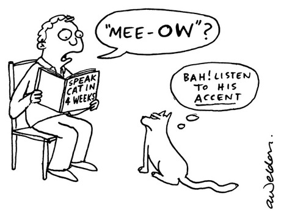
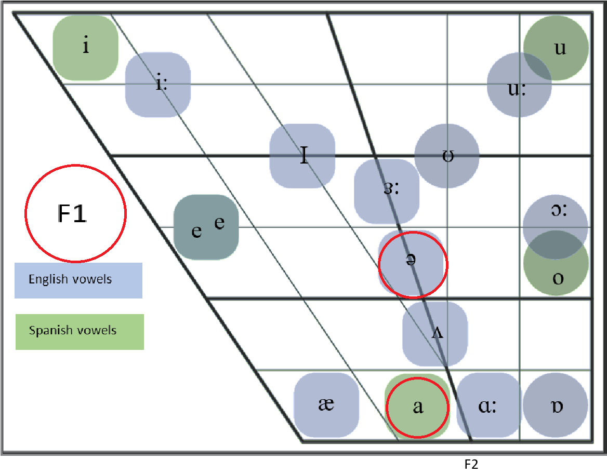
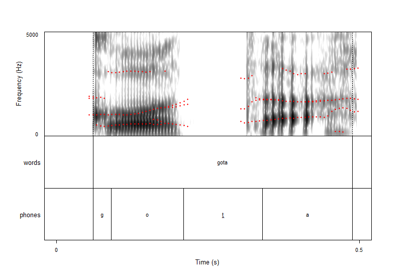
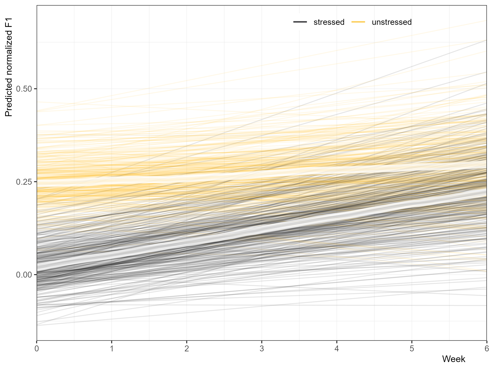
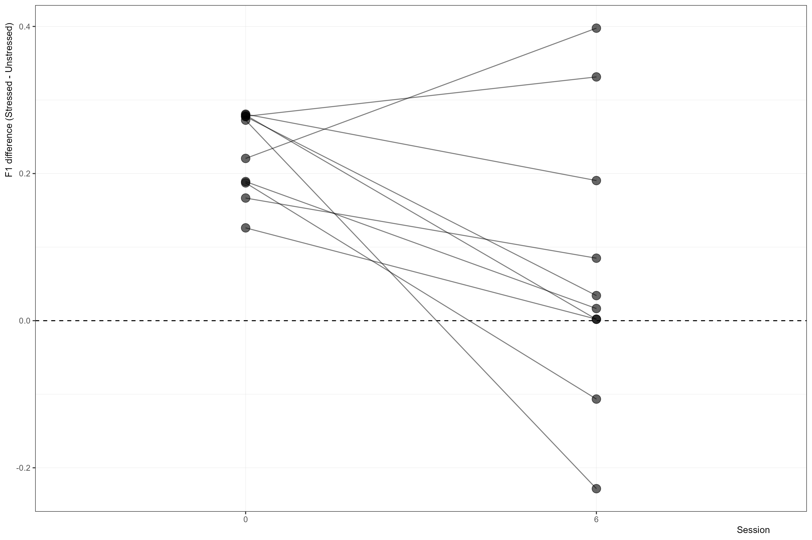
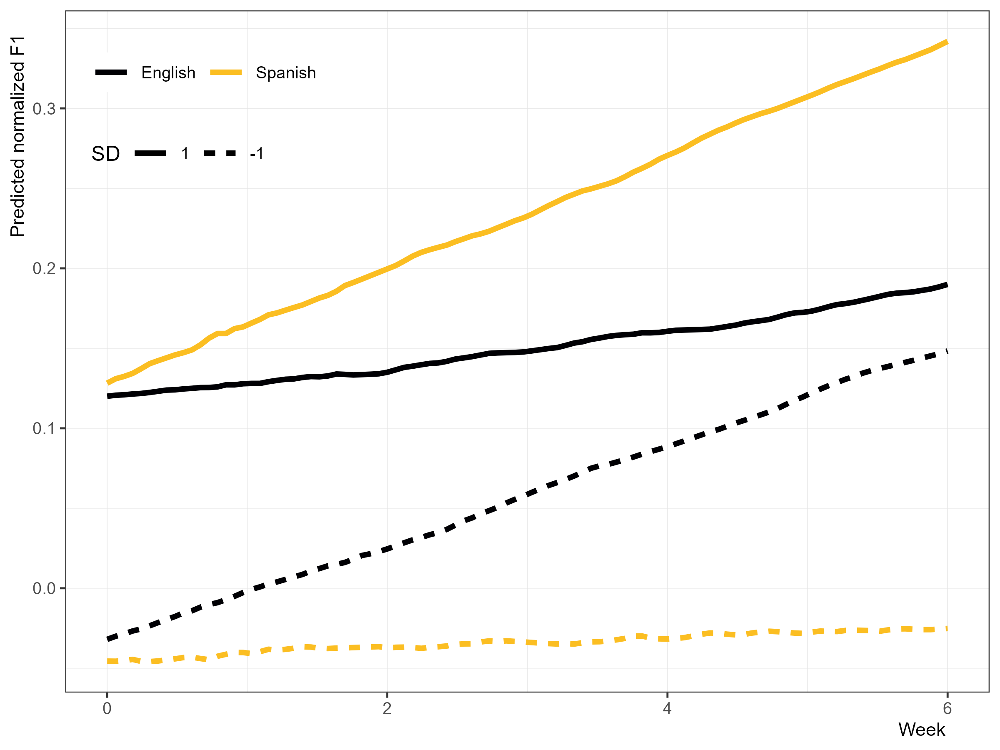
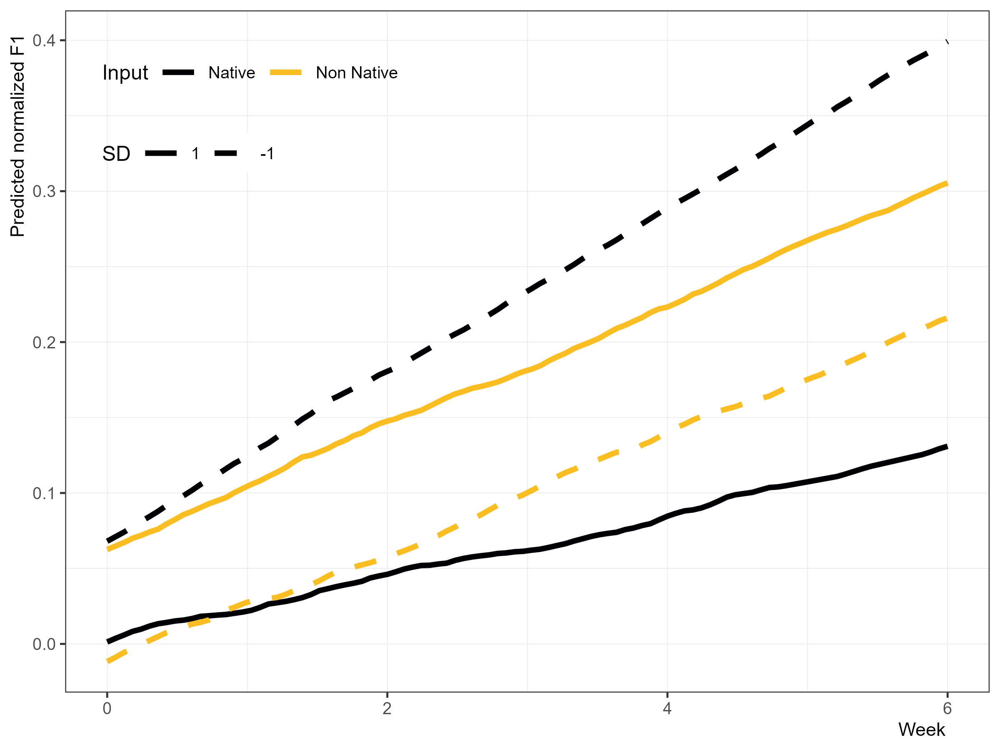
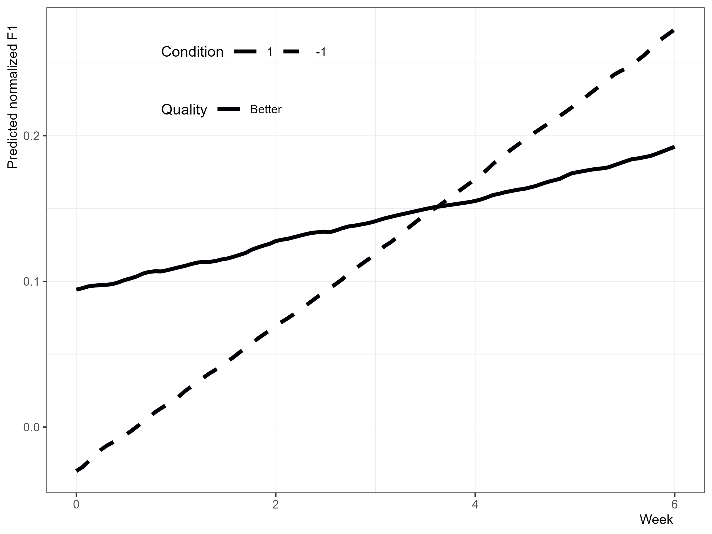
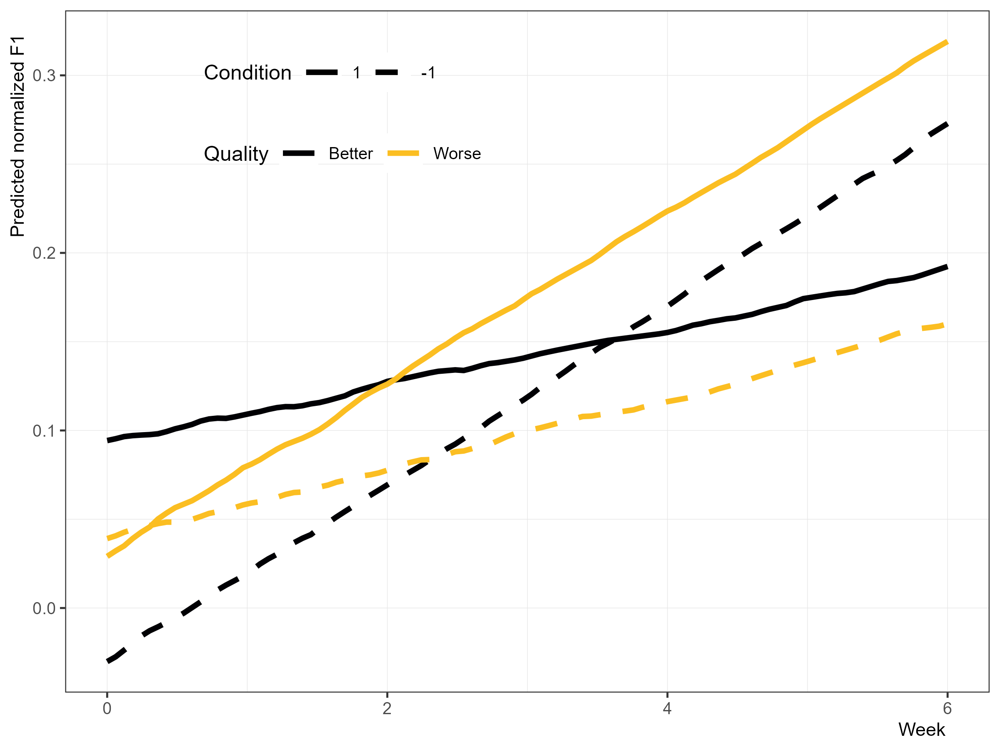
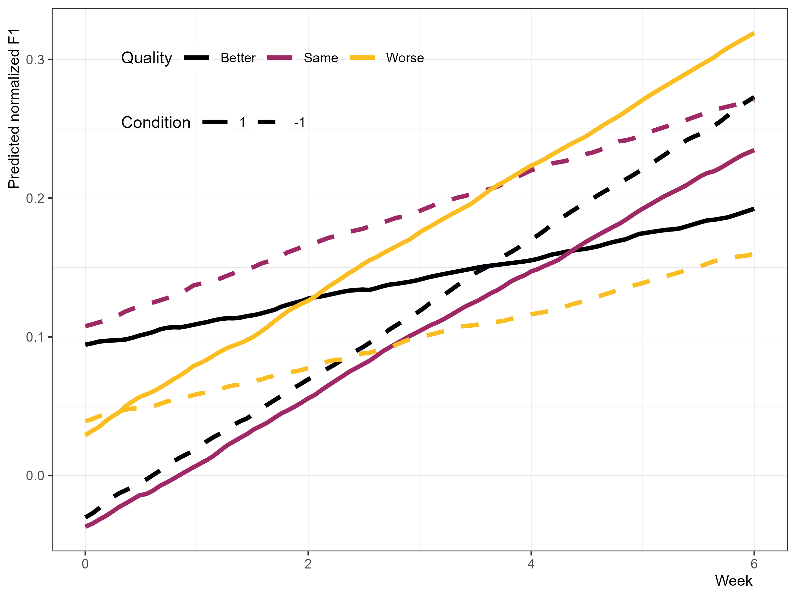

```{r}
#| label: setup
#| include: false
options(htmltools.dir.version = FALSE)
knitr::opts_chunk$set(
  echo = TRUE, 
  fig.asp = 0.5625,
  out.width = "100%", 
  fig.retina = 2, 
  dpi = 300
  )

set.seed(20251108)

source(here::here("scripts","r","00_libs.R"))

theme_psllt <- function(...) {
  list(
    theme_bw(base_family = "Palatino", ...), 
    theme(
      plot.subtitle = element_text(color = "grey40"), 
      panel.grid.major = element_line(color = 'grey90', linewidth = 0.15),
      panel.grid.minor = element_line(color = 'grey90', linewidth = 0.15)
    )
  )
}

theme_set(theme_grey(base_size = 30))

```

# The basics {.transition}

::: {.fragment .fade-up}
::: {.fragment .semi-fade-out}
Input Quantity & Quality
:::
:::

::: {.fragment .fade-up}
::: {.fragment .semi-fade-out}
Unstressed /a/ in Spanish
:::
:::

::: {.fragment .fade-up}
::: {.fragment .semi-fade-out}
Methodology
:::
:::

::: {.fragment .fade-up}
::: {.fragment .semi-fade-out}
Some results
:::
:::

::: {.fragment .fade-up}
::: {.fragment .semi-fade-out}
Some discussion & future direction
:::
:::

# Input in an L2 {.transition}

## Contact with L1 speakers

- Contact with L1 speakers helps accent


::: {.fragment}
- Especially...
  - in informal domains [@moyer2009input; @purcell1980predictors]
  - when personal, social connections are built [@moyer2004age; @flege1995factors]

:::

## A common conundrum

- L2 classroom learners are surrounded by [other L2 students]{.emph} [@gass2013input]
- Either learners interact with their L2 learner peers or the teacher in the classroom...

:::{.fragment}
- Learners produce [greater quantity]{.emph} and [greater diversity]{.emph} of output [in groups]{.emph} [@long1976doing]
- So it makes sense why the communicative approach is popular [@mitchell2002communicative]

:::

## Quality versus Quantity for Accent

- Can L2 learners develop [more target-like phonetics]{.emph} with [L2 input]{.emph}?
- That is... how do [input quantity]{.emph} and [input quality]{.emph} impact phonetic development?



## Quality versus Quantity for Accent

{.absolute top="0" right="0" width="200" height="40"}

- @casillas2020phonetic investigated acquisition of L1 English L2 Spanish /t d/
- Over 7 weeks, collected /t d/ production and self-assessments of...
  - Use: Spanish/English
  - Input: Native, non-native (+, =, -)
- Participants became more target-like overall
- Only [high English use]{.emph} associated with [less movement]{.emph} towards target-like production

## What about [ə]...

::: {.fragment}
Unstressed vowels are [reduced]{.emph} in English, but not Spanish
:::

::: {.fragment .fade-up}
L1 English

[ˈæɾəm] 'atom'

:::

::: {.fragment .fade-up}
[əˈtʰɑmɪk] 'atomic'

:::

::: {.fragment .fade-up}
L1 Spanish

[ˈkasa] 'house'
[maˈma] 'mom'

:::

::: {.fragment .fade-up}
(Beginner) L1 English L2 Spanish

[ˈkasə] 'house'
[məˈma] 'mom'

:::

## L1 English L2 Spanish /a/
L1 English L2 Spanish speakers have issues acquiring [unstressed /a/]{.emph}

::: {.fragment .fade-up}
@iruela1997adquisicion

:::

::: {.fragment .fade-up}
@cobb2009pronunciacion

:::

::: {.fragment .fade-up}
@aldrich2014acquisition

:::

::: {.fragment .fade-up}
@cobb2015adult

:::

::: {.fragment .fade-up}
@bland2016speech

:::

## Why so much trouble with unstressed /a/?

- [Vowel quality]{.emph} is a major cue for English stress [@tremblay2021dutch]
- L1 English L2 Spanish learners must adjust their [cue weighting]{.emph} of stress to accurately perceive/produce Spanish stress [@ortega2013english]

English: [vowel quality]{.emph}, duration, loudness, pitch

Spanish: [duration]{.emph}, loudness, pitch

## Why so much trouble with unstressed /a/?

- So acquisition of unstressed /a/ is wrapped up in...
  - [phonetics]{.emph}: modification of tongue height to approach Spanish /a/
  - [word prosody]{.emph}: modification of stress cues

# The present study {.transition}

## Research Question

1. Do L1 English L2 Spanish learners in an immersion program demonstrate less centralization of unstressed /a/ over the course of six weeks?

2. Does their development depend on a measure of language input?

## Participants

- [10]{.emph} L1 English L2 Spanish upper A2 learners
- [7 weeks]{.emph} of domestic immersion program
- Received no instruction in pronunciation from classes


## Materials & Task

::: {.fragment .fade-up}
delayed shadowing (target word in carrier phrase)
:::

::: {.fragment .fade-up}
126 words that they believed to be Spanish
:::

::: {.fragment .fade-up}
They repeated each word 3 times, for a total of 378 words per participant
:::

::: {.fragment .fade-up}
3780 words in total
:::

::: {.fragment .fade-up}
All words were bisyllabic paroxytones
:::

::: {.fragment .fade-up}
The final vowel was always unstressed /a/
:::

## Some example stimuli

ada

gaka

gota

ita

kaka

eda

## Materials & Task {.smaller}

Weekly self assessments of...

- Language use
  - Spanish
  - English
- Language input
  - Native speaker
  - Non-native speaker
    - Better
    - Same
    - Worse

## So what are we actually measuring?



::: footer
@montiel2024trabajo
:::

## F1 Extraction

::: {.fragment .fade-up}
- Montreal Forced Aligner with manual corrections
:::

::: {.fragment .fade-up}
- `Praat Mass Analyzer` [@vargo2025praat]
- Extracts values every 10% of segment
:::

## F1 Extraction

- F1 values were averaged for each item [@jacewicz2011vowel]
- F1 values normalized on a per-speaker basis [@lobanov1971classification]
  - This removes baseline differences between participants (e.g., vocal tract size differences)
  - Allows us to look at how participants change relative to one another

## F1 Extraction



## Data Analysis (quick & dirty...) {.smaller}

- Model: Bayesian hierarchical regression (Gaussian)
- Dependent variable: F1 (scaled, continuous)
- Predictors: Week, Total Spanish use, Total English use, Native speaker input, Non-native speaker input, Better NN input, Same NN input, Worse NN input
  - All predictors scaled except for session
  - All predictors treated as continuous
- Random intercepts:  Participant, item
- Random slopes: Session

# Results {.transition}

## Stressed versus Unstressed /a/



::: {.notes}
Unstressed /a/ approaches stressed /a/ by the end of the the seven weeks.
Exactly what we expect.
:::

## What about individual changes?



## Total Use of Spanish/English



::: {.notes}
Obvious results:
- more spanish => faster acq
- more english => slower acq
- less spanish => almost no development!
- less english => faster acq

:::

## Native versus Non-Native Input



::: {.notes}
- non-native: slopes are identical, but +1 starts off in a better spot
- less native input => faster acq
- more native input => slower acq
Maybe because they're interacting with teachers?
Maybe because during interaction, natives talk fast & the learner can't pay attention to everything?
:::

## BETTER



::: {.notes}
Less contact w/ +prof => faster acq
More contact w/ +prof => slower acq
But notice that the people with more contact w/ +prof start off better to begin with!
:::

## BETTER + WORSE



::: {.notes}
Less contact w/ -prof => slower acq
More contact w/ -prof => faster acq

:::

## BETTER + WORSE + SAME



::: {.notes}
More contact with =prof => not meaningful for development.
But notice that ppl w/ lower =prof start off in a better spot...

:::

# Discussion {.transition}

## Some expected findings and implications

- Over 7 weeks of domestic immersion, unstressed /a/ becomes more similar to stressed /a/

[ˈkasə] → [ˈkasa]

## Some expected findings and implications

- L1 English L2 Spanish are learning...
  - that [ə] is not used in Spanish
  - what [are]{.emph} and [aren't]{.emph} cues to Spanish stress

- Development in... 
  - [phonetics]{.emph}: learning how to produce /a/ in Spanish
  - [word prosody]{.emph}: learning Spanish stress cues, unlearning English stress cues

## Some more expected findings

- [More]{.emph} English use →  [slower]{.emph} acquisition
- [Less]{.emph} English use →  [faster]{.emph} acquisition


- [More]{.emph} Spanish use →  [faster]{.emph} acquisition
- [Less]{.emph} Spanish use →  [slower]{.emph} acquisition

## Some unexpected findings!

- [More]{.emph} interaction with [natives]{.emph} →  [slower]{.emph} acquisition
- [More]{.emph} interaction with [more proficient L2]{.emph} →  [slower]{.emph} acquisition

## A possible explanation

::: {.fragment}
- learners speak more during group activities than teacher-led activities [@long1976doing]

:::

::: {.fragment}
- lower prof L2 learner in dyad of low + high prof learners speak less in some conditions [@yule1990resolving]

:::

::: {.fragment}
- learners talk more with other learners than L1 speakers [@porter1986learners]

:::

::: {.fragment}
- So maybe this is a matter of [output]{.emph} [@swain1993output]?

:::

## What can this tell us?

- What we can expect from 7 weeks of immersion
- What we can expect without explicit instruction on unstressed /a/
- Acquisition of word stress cues
- L1/L2 interaction

- Now we can think of interventions!

## The bottom line

- Learners improved overall no matter what!

::: {.fragment}
- The strongest predictors were `total English use`, `total Spanish use`, and `L2 input of the same prof level`

:::

# Future Research {.transition}

## Going Forward with this Analysis...

- Need to model F2 as well (back-frontness, just not height!)
- Model with GAMMs to see if we can see exactly when a major change occurs
- Will probably need to reassess the F1 processing
  - Might not make sense to average all 10 datapoints from each vowel... previous research used 5 points [@jacewicz2011vowel]
- Data from other tasks (e.g., picture naming) is available
- Compare Spanish /a/ to English /ə/ and /ɑ/

## Thanks! {.final visibility="uncounted"}

{.absolute top="0" right="0" width="55" height="55"}

</br>


<br>

<table style="border-collapse: collapse; border: none;">
  <tr>
    <td style="text-align: right; padding-right: 10px;">
      <a href="mailto:rme70@scarletmail.rutgers.edu"></a>
    </td>
    <td>rme70@scarletmail.rutgers.edu</td>
  </tr>

  <tr>
    <td style="text-align: right; padding-right: 10px;">
      <a href="https://robertespo.github.io/"></a>
    </td>
    <td>robertespo.github.io</td>
  </tr>

  <tr>
    <td style="text-align: right; padding-right: 10px;">
      <a href="https://github.com/RobertEspo"></a>
    </td>
    <td>\@RobertEspo</td>
  </tr>
  
    <tr>
    <td style="text-align: right; padding-right: 10px;">
      <a href="https://www.jvcasillas.com/quarto-rutgers-theme/"></a>
    </td>
    <td>jvcasillas.com/quarto-rutgers-theme</td>
  </tr>
  
</table>

## References {visibility="uncounted", .scrollable}

::: {#refs .smaller}
:::