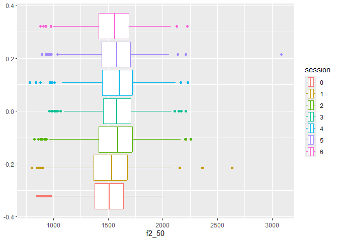
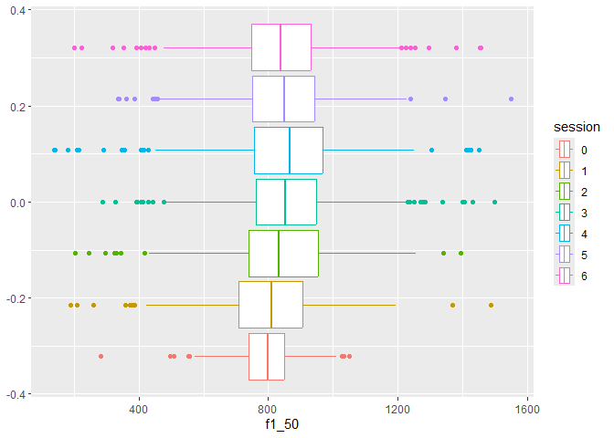
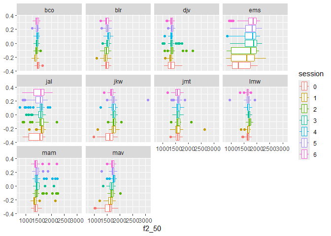
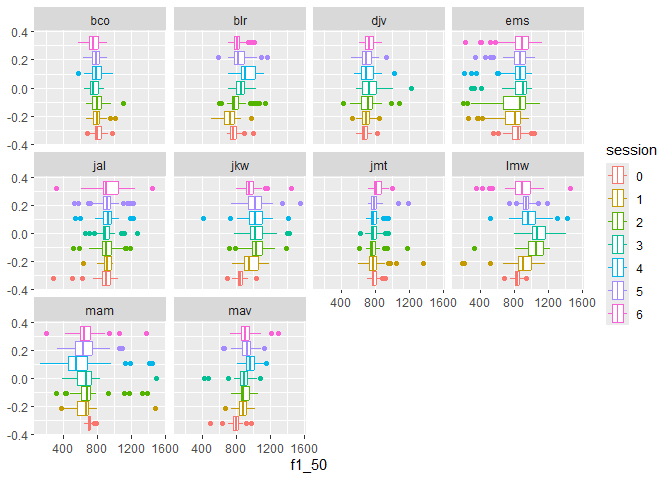
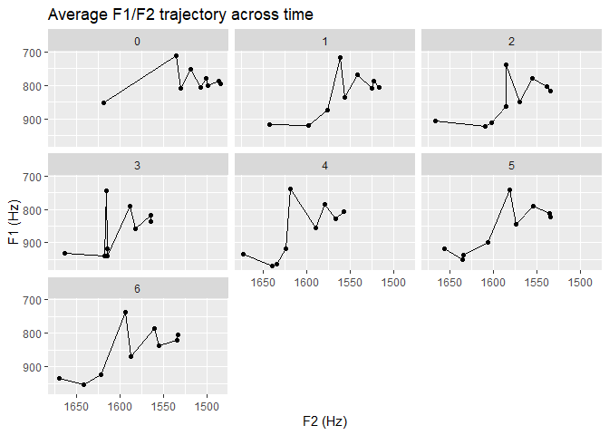
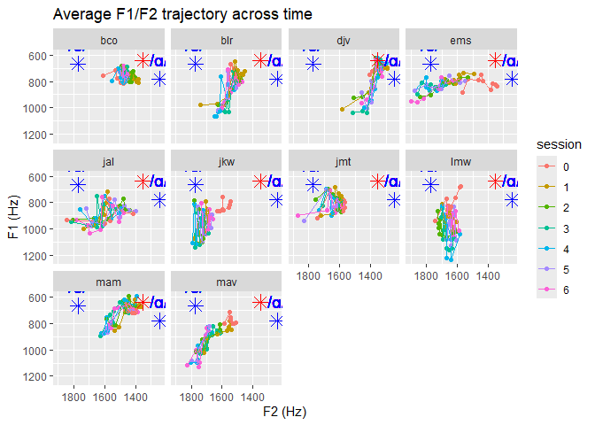
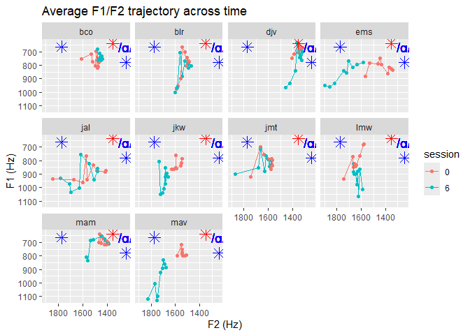

# exploratory, move me somewhere else later

2025-11-25

just for easy access to graphs and stuff.

``` r
source(here::here("scripts","r","00_libs.R"))
```

    here() starts at C:/Users/rober/Desktop/schwa_to_a

    Warning: package 'ggplot2' was built under R version 4.5.1

    ── Attaching core tidyverse packages ──────────────────────── tidyverse 2.0.0 ──
    ✔ dplyr     1.1.4     ✔ readr     2.1.5
    ✔ forcats   1.0.0     ✔ stringr   1.5.1
    ✔ ggplot2   4.0.0     ✔ tibble    3.2.1
    ✔ lubridate 1.9.4     ✔ tidyr     1.3.1
    ✔ purrr     1.0.4     

    ── Conflicts ────────────────────────────────────────── tidyverse_conflicts() ──
    ✖ dplyr::filter() masks stats::filter()
    ✖ dplyr::lag()    masks stats::lag()
    ℹ Use the conflicted package (<http://conflicted.r-lib.org/>) to force all conflicts to become errors

``` r
source(here::here("scripts","r","02_load_data.R"))
```

    Rows: 13440 Columns: 34
    ── Column specification ────────────────────────────────────────────────────────
    Delimiter: ","
    chr  (5): file_name, phoneme, word, preceding_phone, following_phone
    dbl (29): start_time, end_time, f1_10, f1_20, f1_30, f1_40, f1_50, f1_60, f1...

    ℹ Use `spec()` to retrieve the full column specification for this data.
    ℹ Specify the column types or set `show_col_types = FALSE` to quiet this message.

``` r
dat_tidy %>%
  na.omit %>%
  group_by(session) %>%
  summarize(f1_mean = mean(f1_50),
            f2_mean = mean(f2_50)) %>%
  kable()
```

| session |  f1_mean |  f2_mean |
|:--------|---------:|---------:|
| 0       | 795.7134 | 1483.995 |
| 1       | 809.3835 | 1524.898 |
| 2       | 850.0287 | 1569.614 |
| 3       | 859.1652 | 1582.420 |
| 4       | 854.5217 | 1589.232 |
| 5       | 844.5669 | 1573.899 |
| 6       | 838.0321 | 1554.886 |

``` r
dat_tidy %>%
  na.omit %>%
  group_by(participant, session) %>%
  summarize(f1_mean = mean(f1_50),
            f2_mean = mean(f2_50))%>%
  kable()
```

    `summarise()` has grouped output by 'participant'. You can override using the
    `.groups` argument.

| participant | session |   f1_mean |  f2_mean |
|:------------|:--------|----------:|---------:|
| bco         | 0       |  819.2357 | 1477.469 |
| bco         | 1       |  808.5231 | 1384.811 |
| bco         | 2       |  805.0856 | 1425.338 |
| bco         | 3       |  765.4462 | 1455.497 |
| bco         | 4       |  795.6592 | 1460.336 |
| bco         | 5       |  790.2960 | 1453.644 |
| bco         | 6       |  760.6773 | 1446.171 |
| blr         | 0       |  774.2228 | 1486.019 |
| blr         | 1       |  721.8962 | 1451.058 |
| blr         | 2       |  809.9650 | 1487.043 |
| blr         | 3       |  851.9926 | 1519.939 |
| blr         | 4       |  928.8904 | 1567.795 |
| blr         | 5       |  850.7499 | 1512.705 |
| blr         | 6       |  819.7668 | 1492.093 |
| djv         | 0       |  680.6608 | 1341.024 |
| djv         | 1       |  693.8964 | 1297.774 |
| djv         | 2       |  711.7868 | 1379.199 |
| djv         | 3       |  751.5104 | 1352.248 |
| djv         | 4       |  708.1712 | 1332.654 |
| djv         | 5       |  696.8748 | 1357.054 |
| djv         | 6       |  730.5227 | 1336.352 |
| ems         | 0       |  817.8665 | 1369.769 |
| ems         | 1       |  744.3573 | 1489.522 |
| ems         | 2       |  768.7392 | 1581.358 |
| ems         | 3       |  855.0833 | 1737.475 |
| ems         | 4       |  827.8945 | 1711.987 |
| ems         | 5       |  837.3952 | 1715.825 |
| ems         | 6       |  842.0286 | 1746.127 |
| jal         | 0       |  886.8706 | 1415.570 |
| jal         | 1       |  917.7594 | 1628.395 |
| jal         | 2       |  923.4424 | 1580.624 |
| jal         | 3       |  910.3962 | 1558.296 |
| jal         | 4       |  926.9062 | 1559.131 |
| jal         | 5       |  912.3381 | 1498.631 |
| jal         | 6       |  943.0269 | 1506.245 |
| jkw         | 0       |  851.4988 | 1595.236 |
| jkw         | 1       |  975.2551 | 1752.450 |
| jkw         | 2       | 1046.0961 | 1768.438 |
| jkw         | 3       | 1039.2842 | 1768.031 |
| jkw         | 4       | 1018.3073 | 1757.765 |
| jkw         | 5       | 1033.0325 | 1763.185 |
| jkw         | 6       |  973.9146 | 1680.429 |
| jmt         | 0       |  786.7935 | 1574.345 |
| jmt         | 1       |  792.8730 | 1587.892 |
| jmt         | 2       |  780.1083 | 1604.105 |
| jmt         | 3       |  790.9854 | 1592.828 |
| jmt         | 4       |  785.1556 | 1611.426 |
| jmt         | 5       |  800.4520 | 1610.079 |
| jmt         | 6       |  829.9878 | 1571.924 |
| lmw         | 0       |  833.3739 | 1640.899 |
| lmw         | 1       |  902.5557 | 1651.348 |
| lmw         | 2       | 1041.2463 | 1713.303 |
| lmw         | 3       | 1078.9472 | 1690.201 |
| lmw         | 4       |  968.8937 | 1661.598 |
| lmw         | 5       |  941.4912 | 1645.546 |
| lmw         | 6       |  881.0460 | 1626.909 |
| mam         | 0       |  710.4865 | 1400.382 |
| mam         | 1       |  656.8285 | 1373.617 |
| mam         | 2       |  712.4744 | 1467.248 |
| mam         | 3       |  665.2545 | 1471.871 |
| mam         | 4       |  614.1875 | 1471.933 |
| mam         | 5       |  655.3557 | 1454.201 |
| mam         | 6       |  675.2489 | 1417.992 |
| mav         | 0       |  796.5347 | 1537.125 |
| mav         | 1       |  879.8739 | 1629.514 |
| mav         | 2       |  901.3433 | 1689.482 |
| mav         | 3       |  882.7516 | 1677.811 |
| mav         | 4       |  971.1516 | 1757.692 |
| mav         | 5       |  927.6840 | 1728.124 |
| mav         | 6       |  922.6685 | 1722.604 |

``` r
ggplot(dat_tidy, aes(x = f2_50, y = f1_50, color = session)) +
  geom_point(alpha = 0.7, size = 3) +
  scale_y_reverse() +
  scale_x_reverse() +
  labs(x = "F2 (Hz)", y = "F1 (Hz)", title = "Vowel space by session") +
  
  # spanish /a/ from bradlow 1995
  geom_point(aes(x = 1353, y = 638), color = "red", size = 4, shape = 8) +
  geom_text(aes(x = 1353, y = 638, label = "/a/"), color = "red", vjust = -1, size = 5) +
  
  # english schwa from flemming 2009
  geom_point(aes(x = 1772, y = 665), color = "blue", size = 4, shape = 8) +
  geom_text(aes(x = 1772, y = 665, label = "/ə/"), color = "blue", vjust = -1, size = 5) +
  
  # english /a/ from bradlow 1995
  geom_point(aes(x = 1244, y = 780), color = "blue", size = 4, shape = 8) +
  geom_text(aes(x = 1244, y = 780, label = "/ɑ/"), color = "blue", vjust = -1, size = 5)
```

    Warning in geom_point(aes(x = 1353, y = 638), color = "red", size = 4, shape = 8): All aesthetics have length 1, but the data has 3780 rows.
    ℹ Please consider using `annotate()` or provide this layer with data containing
      a single row.

    Warning in geom_text(aes(x = 1353, y = 638, label = "/a/"), color = "red", : All aesthetics have length 1, but the data has 3780 rows.
    ℹ Please consider using `annotate()` or provide this layer with data containing
      a single row.

    Warning in geom_point(aes(x = 1772, y = 665), color = "blue", size = 4, : All aesthetics have length 1, but the data has 3780 rows.
    ℹ Please consider using `annotate()` or provide this layer with data containing
      a single row.

    Warning in geom_text(aes(x = 1772, y = 665, label = "/ə/"), color = "blue", : All aesthetics have length 1, but the data has 3780 rows.
    ℹ Please consider using `annotate()` or provide this layer with data containing
      a single row.

    Warning in geom_point(aes(x = 1244, y = 780), color = "blue", size = 4, : All aesthetics have length 1, but the data has 3780 rows.
    ℹ Please consider using `annotate()` or provide this layer with data containing
      a single row.

    Warning in geom_text(aes(x = 1244, y = 780, label = "/ɑ/"), color = "blue", : All aesthetics have length 1, but the data has 3780 rows.
    ℹ Please consider using `annotate()` or provide this layer with data containing
      a single row.

    Warning: Removed 1 row containing missing values or values outside the scale range
    (`geom_point()`).


``` r
ggplot(dat_tidy, aes(x = f2_50, color = session)) +
  geom_boxplot()
```

    Warning: Removed 1 row containing non-finite outside the scale range
    (`stat_boxplot()`).



``` r
ggplot(dat_tidy, aes(x = f1_50, color = session)) +
  geom_boxplot()
```

    Warning: Removed 1 row containing non-finite outside the scale range
    (`stat_boxplot()`).



``` r
ggplot(dat_tidy, aes(x = f2_50, color = session)) +
  facet_wrap(~participant) +
  geom_boxplot()
```

    Warning: Removed 1 row containing non-finite outside the scale range
    (`stat_boxplot()`).



``` r
ggplot(dat_tidy, aes(x = f1_50, color = session)) +
  facet_wrap(~participant) +
  geom_boxplot()
```

    Warning: Removed 1 row containing non-finite outside the scale range
    (`stat_boxplot()`).



``` r
dat_long <- dat_tidy %>%
  pivot_longer(
    cols = matches("f[12]_\\d+"),
    names_to = c("formant", "percent"),
    names_pattern = "(f[12])_(\\d+)",
    values_to = "value"
  ) %>%
  mutate(percent = as.numeric(percent))

dat_wide <- dat_long %>%
  pivot_wider(names_from = formant, values_from = value)

dat_avg <- dat_wide %>%
  group_by(percent, session) %>%
  summarise(
    f1_mean = mean(f1, na.rm = TRUE),
    f2_mean = mean(f2, na.rm = TRUE)
  )
```

    `summarise()` has grouped output by 'percent'. You can override using the
    `.groups` argument.

``` r
ggplot(dat_avg, aes(x = f2_mean, y = f1_mean)) +
  geom_point() +
  geom_line() +
  facet_wrap(~session) +
  scale_y_reverse() +
  scale_x_reverse() +
  labs(x = "F2 (Hz)", y = "F1 (Hz)", title = "Average F1/F2 trajectory across time")
```



``` r
dat_avg_participants <- dat_wide %>%
  group_by(percent, session, participant) %>%
  summarise(
    f1_mean = mean(f1, na.rm = TRUE),
    f2_mean = mean(f2, na.rm = TRUE)
  )
```

    `summarise()` has grouped output by 'percent', 'session'. You can override
    using the `.groups` argument.

``` r
ggplot(dat_avg_participants, aes(x = f2_mean, y = f1_mean, color = session)) +
  geom_point() +
  geom_line() +
  facet_wrap(~ participant) +
  scale_y_reverse() +
  scale_x_reverse() +
  labs(x = "F2 (Hz)", y = "F1 (Hz)", title = "Average F1/F2 trajectory across time") +
  
  # spanish /a/ from bradlow 1995
  geom_point(aes(x = 1353, y = 638), color = "red", size = 4, shape = 8) +
  geom_text(aes(x = 1353, y = 638, label = "/a/"), color = "red", vjust = -1, size = 5) +
  
  # english schwa from flemming 2009
  geom_point(aes(x = 1772, y = 665), color = "blue", size = 4, shape = 8) +
  geom_text(aes(x = 1772, y = 665, label = "/ə/"), color = "blue", vjust = -1, size = 5) +
  
  # english /a/ from bradlow 1995
  geom_point(aes(x = 1244, y = 780), color = "blue", size = 4, shape = 8) +
  geom_text(aes(x = 1244, y = 780, label = "/ɑ/"), color = "blue", vjust = -1, size = 5)
```

    Warning in geom_point(aes(x = 1353, y = 638), color = "red", size = 4, shape = 8): All aesthetics have length 1, but the data has 630 rows.
    ℹ Please consider using `annotate()` or provide this layer with data containing
      a single row.

    Warning in geom_text(aes(x = 1353, y = 638, label = "/a/"), color = "red", : All aesthetics have length 1, but the data has 630 rows.
    ℹ Please consider using `annotate()` or provide this layer with data containing
      a single row.

    Warning in geom_point(aes(x = 1772, y = 665), color = "blue", size = 4, : All aesthetics have length 1, but the data has 630 rows.
    ℹ Please consider using `annotate()` or provide this layer with data containing
      a single row.

    Warning in geom_text(aes(x = 1772, y = 665, label = "/ə/"), color = "blue", : All aesthetics have length 1, but the data has 630 rows.
    ℹ Please consider using `annotate()` or provide this layer with data containing
      a single row.

    Warning in geom_point(aes(x = 1244, y = 780), color = "blue", size = 4, : All aesthetics have length 1, but the data has 630 rows.
    ℹ Please consider using `annotate()` or provide this layer with data containing
      a single row.

    Warning in geom_text(aes(x = 1244, y = 780, label = "/ɑ/"), color = "blue", : All aesthetics have length 1, but the data has 630 rows.
    ℹ Please consider using `annotate()` or provide this layer with data containing
      a single row.



``` r
ggplot(dat_avg_participants %>% filter(session %in% c(0,6)), aes(x = f2_mean, y = f1_mean, color = session)) +
  geom_point() +
  geom_line() +
  facet_wrap(~ participant) +
  scale_y_reverse() +
  scale_x_reverse() +
  labs(x = "F2 (Hz)", y = "F1 (Hz)", title = "Average F1/F2 trajectory across time") +
  
  # spanish /a/ from bradlow 1995
  geom_point(aes(x = 1353, y = 638), color = "red", size = 4, shape = 8) +
  geom_text(aes(x = 1353, y = 638, label = "/a/"), color = "red", vjust = -1, size = 5) +
  
  # english schwa from flemming 2009
  geom_point(aes(x = 1772, y = 665), color = "blue", size = 4, shape = 8) +
  geom_text(aes(x = 1772, y = 665, label = "/ə/"), color = "blue", vjust = -1, size = 5) +
  
  # english /a/ from bradlow 1995
  geom_point(aes(x = 1244, y = 780), color = "blue", size = 4, shape = 8) +
  geom_text(aes(x = 1244, y = 780, label = "/ɑ/"), color = "blue", vjust = -1, size = 5)
```

    Warning in geom_point(aes(x = 1353, y = 638), color = "red", size = 4, shape = 8): All aesthetics have length 1, but the data has 180 rows.
    ℹ Please consider using `annotate()` or provide this layer with data containing
      a single row.

    Warning in geom_text(aes(x = 1353, y = 638, label = "/a/"), color = "red", : All aesthetics have length 1, but the data has 180 rows.
    ℹ Please consider using `annotate()` or provide this layer with data containing
      a single row.

    Warning in geom_point(aes(x = 1772, y = 665), color = "blue", size = 4, : All aesthetics have length 1, but the data has 180 rows.
    ℹ Please consider using `annotate()` or provide this layer with data containing
      a single row.

    Warning in geom_text(aes(x = 1772, y = 665, label = "/ə/"), color = "blue", : All aesthetics have length 1, but the data has 180 rows.
    ℹ Please consider using `annotate()` or provide this layer with data containing
      a single row.

    Warning in geom_point(aes(x = 1244, y = 780), color = "blue", size = 4, : All aesthetics have length 1, but the data has 180 rows.
    ℹ Please consider using `annotate()` or provide this layer with data containing
      a single row.

    Warning in geom_text(aes(x = 1244, y = 780, label = "/ɑ/"), color = "blue", : All aesthetics have length 1, but the data has 180 rows.
    ℹ Please consider using `annotate()` or provide this layer with data containing
      a single row.


